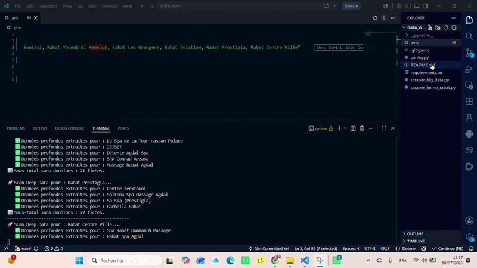

# 🚀 Google Maps Deep Data Scraper & Lead Qualifier

Un script d'extraction automatisé et intelligent pour collecter des leads B2B qualifiés directement depuis l'interface Google Maps. Génère instantanément des fichiers Excel premium, formatés, centrés et triés par criticité business (idéal pour les agences SMMA, le freelancing et la prospection).

## ✨ Fonctionnalités
- **Grid Scraping :** Recherche multi-zone automatique pour contourner les limites de Google.
- **Deep Extraction :** Récupération de l'adresse, des horaires, du vrai numéro de téléphone et du site web.
- **Qualification Business :** Analyse algorithmique des manquements (absence de site web, e-réputation critique).
- **Design Excel Premium :** Génération directe d'un fichier `.xlsx` stylisé (En-têtes en gras, contenu centré, codes couleurs d'urgence).



## 🛠️ Installation & Configuration

1. Clonez ou copiez le dossier du projet.
2. Installez les dépendances requises :
   ```bash
   pip install -r requirements.txt
   playwright install chromium

   